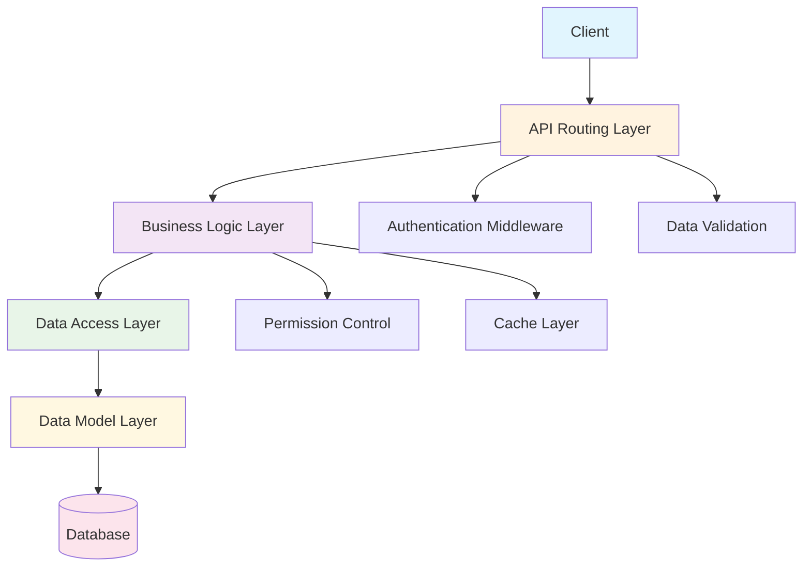
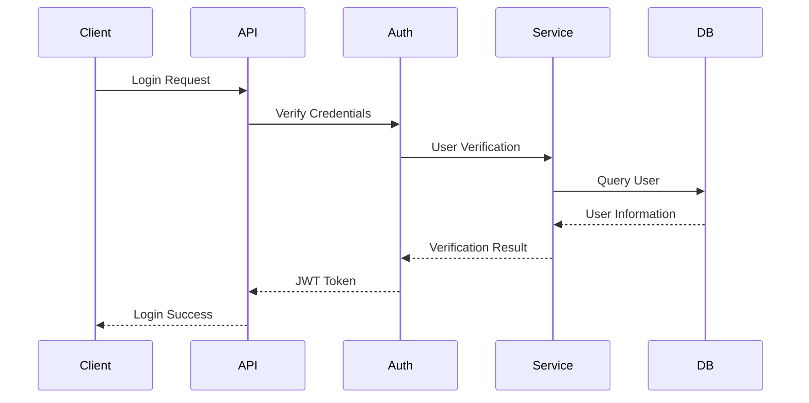
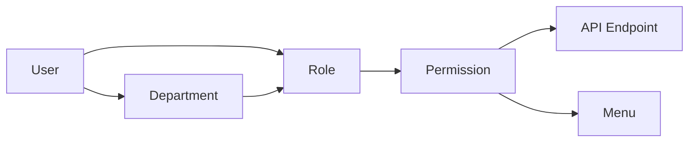
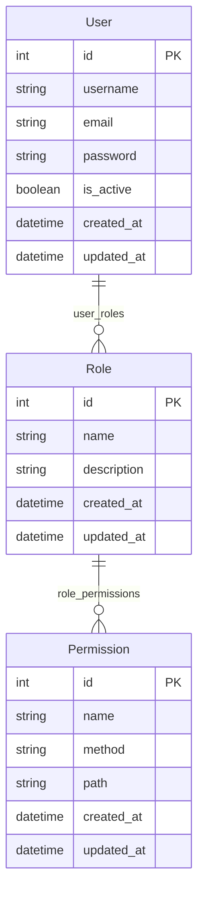

# Architecture Design

## System Architecture Overview

FastAPI Backend Template adopts a classic three-layer architecture design, ensuring code maintainability, scalability, and testability.



## Core Design Principles

### 1. Single Responsibility Principle
Each layer has clear responsibilities, avoiding confusion:

- **API Layer**: Handles HTTP requests and responses
- **Service Layer**: Implements business logic
- **Repository Layer**: Data access and persistence
- **Model Layer**: Data structure definitions

### 2. Dependency Inversion Principle
High-level modules do not depend on low-level modules, achieving decoupling through interfaces:

```python
# Service layer depends on Repository abstraction
class UserService:
    def __init__(self, user_repo: UserRepository):
        self.user_repo = user_repo
```

### 3. Open-Closed Principle
Open for extension, closed for modification:

```python
# Extend functionality through inheritance
class EnhancedUserService(UserService):
    def create_user_with_notification(self, user_data):
        user = super().create_user(user_data)
        self.send_notification(user)
        return user
```

## Layer Architecture Details

### API Layer (src/api/v1/)
Responsible for handling HTTP requests and responses, including:

- **Route Definition**: Define API endpoints
- **Request Validation**: Validate input parameters
- **Response Formatting**: Unified response format
- **Exception Handling**: Unified error handling

```python
@router.post("/users", response_model=UserResponse)
async def create_user(user_data: UserCreate):
    """Create user API endpoint"""
    return await user_service.create_user(user_data)
```

### Service Layer (src/services/)
Contains core business logic, including:

- **Business Rules**: Implement business logic
- **Permission Verification**: Check user permissions
- **Transaction Management**: Coordinate multiple operations
- **Cache Management**: Data caching strategies

```python
class UserService:
    async def create_user(self, user_data: UserCreate):
        # Business logic validation
        if await self.user_repo.exists(email=user_data.email):
            raise ValueError("Email already exists")

        # Password encryption
        user_data.password = hash_password(user_data.password)

        # Create user
        return await self.user_repo.create(user_data)
```

### Repository Layer (src/repositories/)
Responsible for data access, including:

- **CRUD Operations**: Basic data operations
- **Query Building**: Complex query construction
- **Data Mapping**: Model and DTO conversion
- **Transaction Control**: Database transaction management

```python
class UserRepository:
    async def create(self, user_data: UserCreate) -> User:
        return await User.create(**user_data.dict())

    async def get_by_id(self, user_id: int) -> Optional[User]:
        return await User.get_or_none(id=user_id)
```

### Model Layer (src/models/)
Defines data structures, including:

- **Data Models**: Tortoise ORM models
- **Relationship Definitions**: Inter-table relationship configuration
- **Index Configuration**: Database indexes
- **Constraint Definitions**: Data constraints

```python
class User(BaseModel, TimestampMixin):
    id = fields.IntField(pk=True)
    username = fields.CharField(max_length=50, unique=True)
    email = fields.CharField(max_length=100, unique=True)

    # Relationship definitions
    roles = fields.ManyToManyField("models.Role", related_name="users")
```

## Core Components

### 1. Authentication System
JWT-based authentication mechanism:



### 2. Permission Control
RBAC-based permission model:



### 3. Database Design
Use Tortoise ORM for data persistence:



## Design Patterns

### 1. Dependency Injection
Use FastAPI's dependency injection system:

```python
# Dependency definition
def get_user_service() -> UserService:
    return UserService(user_repository)

# Use dependency
@router.post("/users")
async def create_user(
    user_data: UserCreate,
    user_service: UserService = Depends(get_user_service)
):
    return await user_service.create_user(user_data)
```

### 2. Repository Pattern
Encapsulate data access logic:

```python
class BaseRepository:
    def __init__(self, model: Type[Model]):
        self.model = model

    async def create(self, data: dict) -> Model:
        return await self.model.create(**data)

    async def get_by_id(self, id: int) -> Optional[Model]:
        return await self.model.get_or_none(id=id)
```

### 3. Service Layer Pattern
Encapsulate business logic:

```python
class BaseService:
    def __init__(self, repository: BaseRepository):
        self.repository = repository

    async def create(self, data: BaseModel) -> Model:
        # Business logic processing
        validated_data = self.validate_data(data)
        return await self.repository.create(validated_data)
```

## Extension Guide

### Adding New Feature Modules

1. **Create Model** (src/models/):
```python
class Product(BaseModel, TimestampMixin):
    name = fields.CharField(max_length=100)
    price = fields.DecimalField(max_digits=10, decimal_places=2)
```

2. **Create Repository** (src/repositories/):
```python
class ProductRepository(BaseRepository):
    def __init__(self):
        super().__init__(Product)
```

3. **Create Service** (src/services/):
```python
class ProductService(BaseService):
    def __init__(self, product_repo: ProductRepository):
        super().__init__(product_repo)
```

4. **Create API** (src/api/v1/):
```python
@router.post("/products")
async def create_product(
    product_data: ProductCreate,
    product_service: ProductService = Depends(get_product_service)
):
    return await product_service.create(product_data)
```

### Custom Middleware

```python
@app.middleware("http")
async def custom_middleware(request: Request, call_next):
    # Process before request
    response = await call_next(request)
    # Process after response
    return response
```

## Performance Optimization

### 1. Database Optimization
- Use `select_related()` to preload related data
- Use `prefetch_related()` to optimize many-to-many queries
- Add appropriate database indexes

### 2. Caching Strategy
- Use Redis to cache frequently queried data
- Implement query result caching
- Set reasonable cache expiration times

### 3. Async Processing
- Use asynchronous I/O operations
- Properly use connection pools
- Avoid blocking operations

## Summary

This architecture design provides:

- ✅ **Clear layer structure**
- ✅ **High testability**
- ✅ **Good scalability**
- ✅ **Strong type safety**
- ✅ **Complete error handling**

By following these design principles and patterns, you can build stable, efficient, and maintainable enterprise-level applications.
